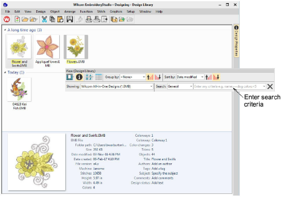
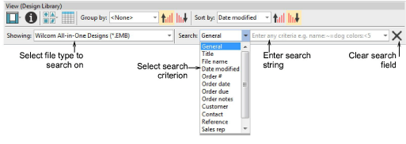
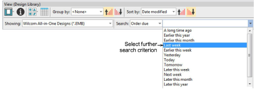

# Searching the library

Design Library allows for fast searching of designs on shared local network drives. This is important for businesses with multiple computers and multiple users creating and accessing EMB, machine files, or graphic files.

Use the View toolbar to search for names or keywords or sort designs by name, create date, and other criteria. The Search field is very powerful.

## Search criteria

In fact you can search on any criterion displayed on the preview pane. To begin with, select a file type to search on, and select criteria from the droplists.

Searchable fields include common commercial categories:

- General
- Title
- File name
- Date modified
- Order #
- Order date
- Order due
- Order notes
- Customer
- Contact
- Reference
- Sales rep
- Design status

Once you have selected a search criteria – e.g. ‘Order due’ – select further criteria from the second droplist.

## Search strings

Optionally, enter search strings directly into the search field – e.g. ‘colors<5’ – meaning, ‘fewer than 5 colors’. Search strings default to ‘CONTAINS’ not ‘EQUALS’ unless you enter a different criteria.

There is also an ‘All’ criterion which allows you to do perform advanced queries using the Windows Search syntax such as:

author:”Wilcom” colors:<5 stitches:<3000

This will narrow the search to only those designs which:

- have been authored by ‘Wilcom’
- have less than 5 colors, and
- have less than 3000 stitches.

Make sure you use correct syntax. Each field name must include a colon (:) after the name. Any names, such as ‘Wilcom’, need to be placed between double quotes – “Wilcom”. Use the Clear button to clear the Find field before conducting another search.

## Reserved terms

Certain terms are ‘hard-coded’ in the design file. When conducting searches in languages other than English, you need to make sure that these ‘reserved’ terms are entered in English. Note that the following are not natively available in the Operating System and will always appear in English:

- Colors
- Height
- Machine
- Objects
- Stitches
- Trims
- Width
  :::info Note
  Search criteria with two words needs to be entered without spaces as shown:

| Search criteria | Enter...      |
| --------------- | ------------- |
| Color changes   | Colorchanges  |
| Design status   | Designstatus  |
| Order date      | Orderdate     |
| Order due date  | Orderduedate  |
| Order notes     | Ordernotes    |
| Product colors  | Productcolors |
| Product type    | Producttype   |
| Sales rep       | Salesrep      |

:::

::: info Note
When searching on non-reserved terms, you can search for two words separated by spaces and the search will turn up all designs with either word. If you want to find designs with both words, add a + between them – e.g. koi+fish. If you want an exact match, you need to include inverted commas in the search string – e.g “my design”.
:::
