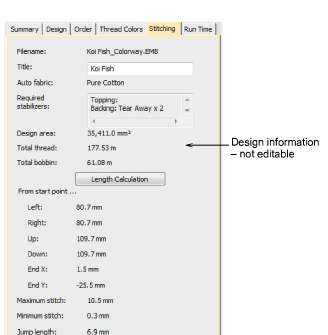

# Stitching tab

The Stitching tab displays technical stitching details mainly of use to machine operators. Information includes such details as target fabric, required stabilizers, as well as total thread estimates. These may be used for costings as well as production requirements. Bobbin length calculation can be further refined if you are planning a large production run.

Data is extracted from the design file and, apart from title and bobbin length calculation, cannot be modified.

| Field                        | Description                                                                                                                                                                |
| ---------------------------- | -------------------------------------------------------------------------------------------------------------------------------------------------------------------------- |
| Filename                     | File name of the selected design. This will often be a number or alphanumeric format for easy cataloging.                                                                  |
| Title                        | Defaults to filename. Add a more descriptive name for easy searching. This name appears on the approval sheet or worksheet.                                                |
| Auto fabric                  | Predefined [fabric settings](../../glossary/glossary) used in current design.                                                                                              |
| Required stabilizer          | Indicates recommended stabilizer(s) for selected fabric type.                                                                                                              |
| Design area                  | Total area covered by design – used for estimating hoop sizes, fabric requirements, 3D foam, or whether design will fit target location.                                   |
| Total thread                 | Indicates total meterage of top thread required to stitch out the design.                                                                                                  |
| Total bobbin                 | Indicates total meterage of bottom (bobbin) thread required to stitch out the design. These figures may be required for inventory control depending on business practices. |
| Length calculation           | Allows you to revise thread usage estimates according to target fabric thickness.                                                                                          |
| Left / right / up / down     | Depending on where the design start/end point has been set, these figures indicate the distance from that point.                                                           |
| Max/min stitch / jump length | The maximum and minimum stitch lengths, and maximum jump stitch length in the design.                                                                                      |

## Related topics...

- [Working with fabrics](../../Digitizing/properties/Working_with_fabrics)
- [Manage fabrics](../../Digitizing/properties/Manage_fabrics)
- [Thread usage estimates](../../Basics/threads/Thread_usage_estimates)
- [Design Hooping](../../Production/hoops/Design_Hooping)
