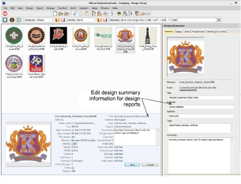

# Summary tab

Summary information about a design can be viewed and edited in the Summary tab. Generally this information is used to improve searchability. Use the information to search and filter designs by author, title, or subject. Tags can be added to improve searchability. Information can be added in the docker itself or in the Details pane (if activated). Click Save to save details with the design file.

Click a field and enter any text which will help you or others identify the design at a later date. All information on this tab is also included in the production worksheet. Information types include:

| Field    | Description                                                                                                                                         |
| -------- | --------------------------------------------------------------------------------------------------------------------------------------------------- |
| Title    | Defaults to filename. Add a more descriptive name for easy searching. This name appears on the approval sheet or worksheet.                         |
| Subjects | This may conform to the primary category by which the design is cataloged – e.g. the name of the containing folder.                                 |
| Authors  | Name of digitizer and/or designer – appears in production worksheet footer.                                                                         |
| Tags     | Keywords for potential Design Library searches.                                                                                                     |
| Comments | These comments are included in the production worksheet and are intended for production staff. They may include instructions for machine operators. |

## Related topics...

- [Preview design reports](../../Basics/view/Preview_design_reports)
