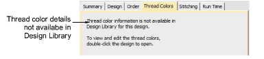

# Thread Colors tab

The Thread Colors tab displays the color sequence and stitch counts for each design ‘element’. Elements equate to color changes. The tab also provides thread usage estimates which may be used for costings as well as production requirements. This information cannot be viewed in Design Library. The design first needs to be opened in Wilcom Workspace.

## Related topics...

- [Design thread colors](../../Digitizing/colorways/Design_thread_colors)
- [Name design elements](../../Digitizing/colorways/Name_design_elements)
- [Assign thread colors](../../Basics/threads/Assign_thread_colors)
- [Thread usage estimates](../../Basics/threads/Thread_usage_estimates)
- [Modify thread details](../../Basics/threads/Modify_thread_details)
- [Other general options](../../Setup/settings/Other_general_options)
