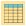
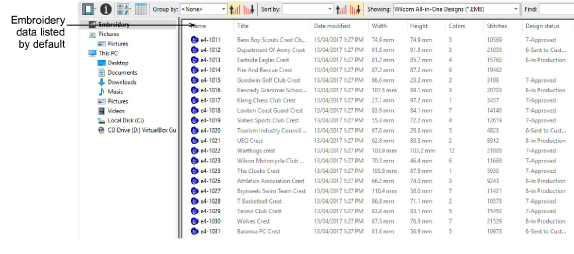

# View design details

|  | Use View > Reset Detail Columns to reset the columns displayed in details view to the default layout. |
| ------------------------------------------------------ | ----------------------------------------------------------------------------------------------------- |

Default detail columns vary by file type and are controlled by MS Windows®. Design Library, however, provides additional columns for data derived from embroidery files. These may include design status, customer, order date, etc. Such details are primarily intended for use with EMB but can also apply to other embroidery formats.

When viewing design lists in Details view, columns can be arranged in any order and with a variety of criteria. Sometimes Windows will reset detail columns to Windows defaults, even for EMB files. To return to the default layout, simply click the Reset Detail Columns button.
