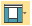
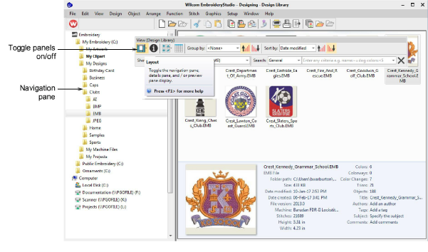
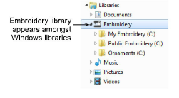
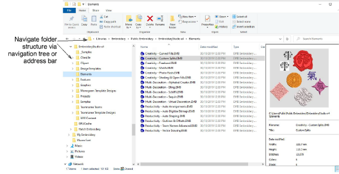

# Viewing designs in network folders

|  | Click Mode > Design Library to open the Design Library window from which to search and catalogue designs as well as quotes, orders, and approvals. |
| ---------------------------------------------- | -------------------------------------------------------------------------------------------------------------------------------------------------- |
|                | Use View > Layout to toggle navigation pane, details pane, and/or preview pane display.                                                            |

Navigating to design folders with Design Library is similar to browsing with File Explorer. Your access to design folders on your local network is only limited by access rights determined by your [System Administrator](../../glossary/glossary). View any supported file type residing in design folders. Designs can be searched, sorted, grouped, and browsed by customer or order. Click the Design Library icon on the Mode toolbar. Design Library opens in its own window.

Design Library is ‘virtual’ in the sense that any designs on your system can be located and displayed within the library. This folder acts as a container which appears in File Explorer amongst your other Windows libraries.

You can add folders both in File Explorer and in the Design Library itself. The initial folder structure is created by your installation. However, any folders on your local network which contain embroidery designs or artwork can potentially be included and viewed in Design Library.

::: tip
Like File Explorer, the Design Library display can be refreshed with a simple F5 keypress.
:::
