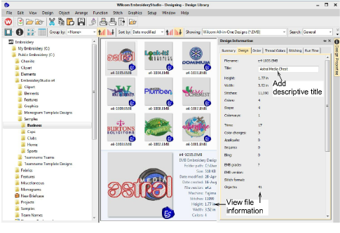

# Viewing & managing design information

|  | Use View (Design Library) > Design Information to view and modify design details prior to design approval or stitchout. |
| ---------------------------------------------------- | ----------------------------------------------------------------------------------------------------------------------- |

Manage and check design details via the Design Information docker. This is always advisable when receiving orders or prior to design approval or stitchout. Summary and order information may be provided by the digitizer or sales team. This information can be printed on approval sheets and production worksheets. Choose a file and select Design Information via the View toolbar or Design menu.

All designs in Design Library can be tagged for easy search and find. Summary information such as design title, subject, authors, tags, is fully customizable. Order information can also be associated with any supported design file. All additional information is saved with the actual design file and can be viewed in any software that can read EMB files. It is often desirable to edit design details within the Design Library without having to open in the design window. This also enables customer service staff to enter/change details without modifying the embroidery design itself.

Caution: When updating information in the Design Information docker, it may take some time for the index to update before you can search on that data.

## Related topics...

- [Summary tab](Summary_tab)
- [Design tab](Design_tab)
- [Order tab](Order_tab)
- [Thread Colors tab](Thread_Colors_tab)
- [Stitching tab](Stitching_tab)
- [Runtime tab](Runtime_tab)
