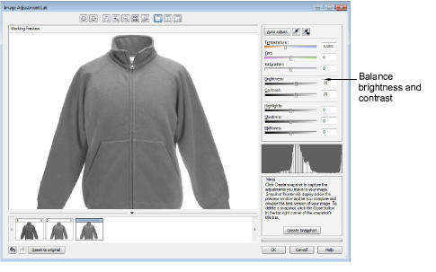
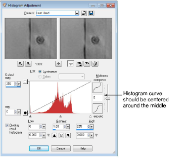

# Adjust image brightness and contrast

Generally speaking, the middle gray becomes the selected color and lighter and darker grays become shades of that color. For this reason we need to ensure that the image is correctly balanced in terms of brightness and contrast.

Use a luminance histogram to assess where brightness and contrast lie on the graph. You want to have a good spread of dark and light shades of gray, providing good contrast. The histogram curve should be centered around the middle.

