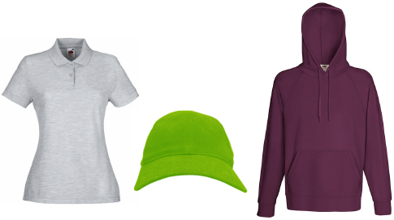
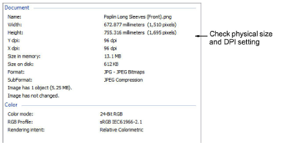

# Choose suitable source images

A lot depends on the quality of the source image you choose for use as a product backdrop. As a starting point, you need high resolution photos of the garment you want to use – e.g. front and back. While images are intended mainly for onscreen viewing, they may also be printed on approval sheets.

## Size

If you take a small product image and blow it up to actual size, it will not gain in quality or resolution. There needs to be enough image data (DPI) to display the image satisfactorily at actual size. For optimum quality you need an image with:

- Real-world dimensions that represent the garment at actual size – e.g. 60 cms wide x 90 cms high
- Minimum of 96 DPI, ideally closer to 160 DPI.

## Color depth

Make sure you are using an RGB (24 bit color) photo. Commonly used formats include RAW, PNG, TIFF or JPG.

Note: As well as reasonably high resolution photos, you need a good photo editor. Most screenshots in this document are taken from Corel PhotoPaint which is bundled with EmbroideryStudio.
