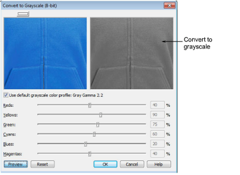

# Convert to grayscale

Convert the selected image to grayscale making sure that transparency is preserved.

::: tip
With some photo editors, grayscale images have a limited set of tools that make it difficult to perform the subsequent tasks. It is preferable to ‘desaturate’ the image. Another advantage of desaturation vs grayscale is that you preserve all image data. Hence, you are less prone to lose image information like textures, shadows and highlights.
:::
