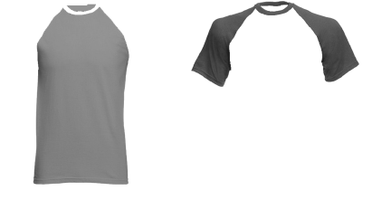
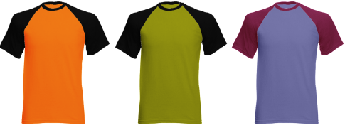

# Convert to grayscale

Convert the resulting objects to grayscale making sure that transparency is preserved. Remember, you want to have a good spread of dark and light shades of gray, providing good contrast.

The layers can then be colored separately in EmbroideryStudio.

