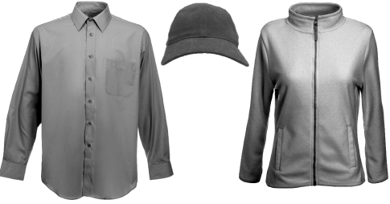

# Converting to grayscale

Product images which are added to the software need to be grayscale, as shown below. These are then colored in EmbroideryStudio according to user requirements.

## Related topics...

- [Convert to grayscale](Convert_to_grayscale)
- [Adjust image brightness and contrast](Adjust_image_brightness_and_contrast)
- [Save as PNG](Save_as_PNG)
