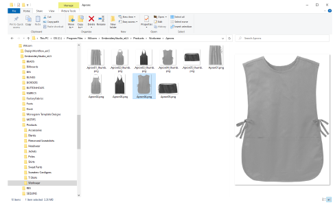

# Copy to folder location

All image files need to be saved in the same location...

- Navigate to the following location:

C:\\Program Files\\Wilcom\\EmbroideryStudio_e4.x\\Products

Garments are organized by number of colors and garment type – e.g. 2 colors, Caps, Kids, etc.

- Create your own sub-folders as necessary and copy in your prepared image files.

Note: The file name will be the name that identifies the garment in Product Visualizer.

## Related topics...

- [Custom asset locations](../manage%5Fassets/Custom%5Fasset%5Flocations#XREF%5F78115%5FCustom%5Fasset)
