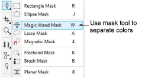
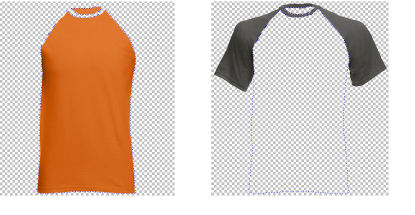

# Prepare the layers

In order for EmbroideryStudio to detect the number of colors used in your garment, you need to separate the photo into different layers for each. The typical photo tool used to separate colors is the masking tool.

Tip: Some graphics packages refer to ‘objects’ rather than ‘layers’.

## Resulting layers

For example, let’s say you need to separate a T-shirt which employs two colors. The resulting layers (or objects) would look like this:

Make sure the background of each layer is transparent.

## Layer rules

The following rules apply to a multi-color shirt. Variations on the same approach should be applied to other products such as multi-color caps.

- The body color should always be the layer 1 file.
- Sleeves / collar, if present, should always be the layer 2 file.
- Any other trims and tipping should always be the layer 3 file, unless there is no layer 2.
- Each layer must be saved as a separate grayscale PNG file.
- Each PNG file needs to have identical dimensions, DPI, etc.

Tip: it is important to first create the layers / masks, objects, etc, and then convert the resulting images to grayscale / desaturated.
