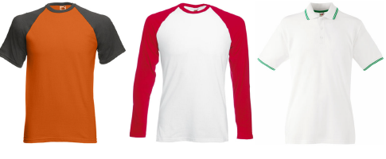

# Preparing multi-color samples

Most garments use only one color but you will find products with two or even three colors. This topic deals with the technique of preparing source images for deployment in EmbroideryStudio as multi-color product templates for the product visualizer.

You follow exactly the same procedure as for single-color designs, except that you need to separate your multi-color image before converting to grayscale.

## Related topics...

- [Prepare the layers](Prepare_the_layers)
- [Convert to grayscale](Convert_to_grayscale1)
- [Save your layers](Save_your_layers)
