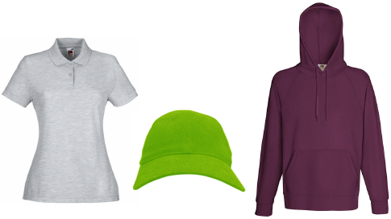

# Preparing samples

This topic deals with the technique of preparing source images for deployment in EmbroideryStudio as product templates for Product Visualizer. The most common scenario when creating product templates is a single-color product image.

## Related topics...

- [Choose suitable source images](Choose_suitable_source_images)
- [Crop the image](Crop_the_image)
- [Set image size](Set_image_size)
- [Set transparency](Set_transparency)
