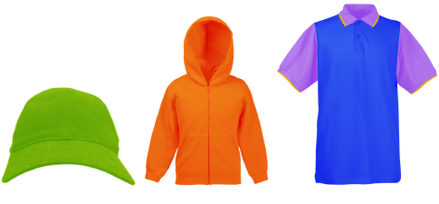

# Product Visualizer Templates

EmbroideryStudio allows you to choose a garment or product backdrop on which to position designs and decorations. The Product Visualizer feature is used to display location, size and overall appearance for visualization and customer approval purposes. Production worksheets provide an option to print approval sheets with or without garment backdrops.

Choose colors for each product type. The software provides a library of garments of common brands and styles. Most garments use only one color but multi-color products with up to three layers are supported. You can add your own single-color and multi-color product templates to the software by following the method outlined in this section.

## Related topics...

- [Preparing samples](Preparing_samples)
- [Converting to grayscale](Converting_to_grayscale)
- [Preparing multi-color samples](Preparing_multi-color_samples)
- [Deploying product templates](Deploying_product_templates)
