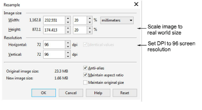

# Set image size

Scale the image to real world size using a tool such as the Resample dialog below.

Indicative settings:

- Untick the ‘Maintain original size’ checkbox.
- Make sure ‘aspect ratio’ is locked.
- Change either width or height to match the physical size of the garment or article. For example, height = 50cm. The new size needs to be equal to or less than original. If not, the resolution will be too low and the image will be pixelated.
- Change the resolution to 96 DPI or higher. Packaged product images are set to 96 DPI for standard screen resolution. However, new monitors are capable of higher resolutions such as 160 DPI.
- Ideally, the original file size (total number of pixels) should be maintained so the image does not lose data (quality).

Note: Simply increasing the DPI to 96 will not add resolution to a low-res image. It will only duplicate existing pixels.
