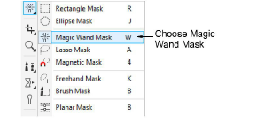
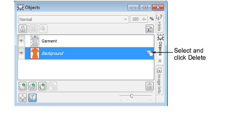
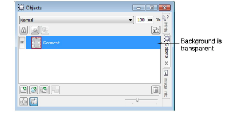

# Set transparency

Because you want product images to display correctly on any color background, you need to make the image background transparent. Make sure anti-aliasing is activated. Image edges will appear smoother. The transparent background usually appears as a gray checker pattern. If you are using Corel PhotoPaint, follow these steps…

## To set the transparency...

1. Choose Magic Wand Mask.

2. Click the background to select the whole area.

3. If needed, click the + button to add more area until you have selected the whole background.

4. Adjust the ‘Tolerance’ setting to limit the range of colors included in the transparency. If the background is too similar to the foreground, this can become problematic.

5. Click Invert Mask. The garment alone will be selected.

6. Select Object > Create > Cut Selection.

7. In the Object Manager, select the background and click Delete.

8. The garment will be appear on a gray and white checker pattern. This means the background is transparent.

