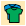
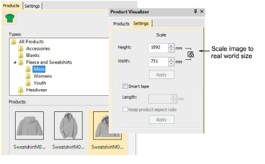
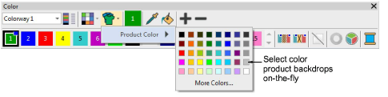

# Test product templates

|  | Use Color > Product Visualizer to choose a garment or product backdrop on which to position your decoration. |
| ------------------------------------------------------ | ------------------------------------------------------------------------------------------------------------ |
|              | Click View > Show Product to toggle current product display. Right-click for Product Visualizer settings.    |
|          | Use Zoom > Zoom to Product to view the entire product in the design window.                                  |

While you can create separate templates for different garment sizes, EmbroideryStudio assumes a ‘Large’ size garment. This can be further scaled within EmbroideryStudio to arrive at an exact size for display purposes.

Apply different colors and see how they look on screen. For best results, try the first two rows of the color selector. These less saturated colors usually color well. Highly saturated colors like bright red, cyan, and magenta tend to wash out the product image.

Try selecting product colors on-the-fly using the Color Palette flyout:

## Related topics...

- [Visualize products](../../Digitizing/colorways/Visualize_products)
