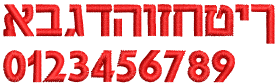
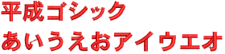
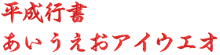
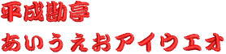
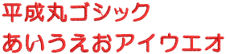
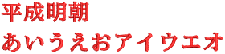

# Non-Roman fonts

| Font              |     | Sample                                             | Recommended sizes | Join method |     |     |     |
| ----------------- | --- | -------------------------------------------------- | ----------------- | ----------- | --- | --- | --- | --- |
|                   | Min | Max                                                |                   |             |     |     |     |     |
|                   | in. | mm                                                 | in.               | mm          |     |     |     |     |
| Cyrillic fonts    |     |                                                    |                   |             |     |     |     |
| Greek             |     |                      | 0.3               | 8           | 2.0 | 50  | CJ  |
| Greek Script      |     |          | 0.48              | 12          | 4.0 | 100 | CJ  |
| Greek Spionic     |     |        | 0.4               | 10          | 2.4 | 60  | CJ  |
| Jikharev          |     |                | 0.4               | 10          | 1.8 | 45  | CJ  |
| Russian Textbook  |     |  | 0.3               | 8           | 1.8 | 45  | CJ  |
| Hebrew fonts      |     |                                                    |                   |             |     |     |     |
| Hebrew Chaya      |     |          | 0.3               | 8           | 1.6 | 40  | CJ  |
| Japanese fonts    |     |                                                    |                   |             |     |     |     |
| Japanese Kaisho   |     |                | 0.32              | 8           | 2.7 | 70  | CJ  |
| Heisei Gosic      |     | \[       | 0.4               | 10          | 2.7 | 70  | CJ  |
| Heisei Gyosho     |     |        | 0.32              | 8           | 2.7 | 70  | CJ  |
| Heisei Kaisho     |     |        | 0.32              | 8           | 2.7 | 70  | CJ  |
| Heisei Kantei     |     |        | 0.4               | 10          | 2.7 | 70  | CJ  |
| Heisei Maru Gosic |     |  | 0.4               | 10          | 2.7 | 70  | CJ  |
| Heisei Mincho     |     |        | 0.4               | 10          | 2.7 | 70  | CJ  |

::: info Note
Japanese fonts (3000 characters each) are available for download from [www.wilcom.com](https://help.wilcom.com/hc/en-us/articles/360000523096-Japanese-Font-Pack) for customers who wish to use them.
:::
