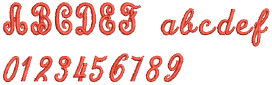
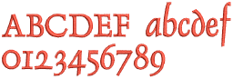

# Roman fonts

| Font                    | Sample | Recommended sizes                                        | Join method |     |      |     |     |
| ----------------------- | ------ | -------------------------------------------------------- | ----------- | --- | ---- | --- | --- |
| Min                     | Max    |                                                          |             |     |      |     |     |
| in.                     | mm     | in.                                                      | mm          |     |      |     |     |
| 3D fonts                |        |                                                          |             |     |      |     |     |
| 3D Block2               | ^      |                      | 0.6         | 15  | 1.2  | 30  | AD  |
| 3D Brush Script         | ^      |            | 0.8         | 20  | 1.6  | 40  | AD  |
| 3D Emphatic             | ^      | s                | 0.8         | 20  | 2.4  | 60  | AD  |
| 3D Futuro               | ^      |                      | 0.8         | 20  | 1.0  | 25  | AD  |
| 3D London               | ^      |                      | 0.8         | 20  | 1.2  | 30  | AD  |
| 3D Monoglyceride        | ^      |        | 0.8         | 20  | 1.2  | 30  | AD  |
| 3D Sofachrome           | ^      |              | 0.55        | 15  | 0.8  | 20  | AD  |
| Appliqué fonts          |        |                                                          |             |     |      |     |     |
| College Appliqué        |        |        | 1.0         | 25  | 3.2  | 80  | AD  |
| Crest Appliqué          |        |            | \-          | \-  | \-   | \-  | AD  |
| Glory Appliqué          |        |            | 1.2         | 30  | 4.0  | 100 | AD  |
| Bling fonts             |        |                                                          |             |     |      |     |     |
| Bling Block             |        |                  | \-          | \-  | \-   | \-  | AD  |
| Bling Hollow            |        |                | \-          | \-  | \-   | \-  | AD  |
| Bling Script            |        |                | \-          | \-  | \-   | \-  | AD  |
| Block fonts             |        |                                                          |             |     |      |     |     |
| Advent                  | ^      |                          | 0.4         | 10  | 2.0  | 50  | CJ  |
| Albert                  | ^      |                          | 0.4         | 10  | 0.8  | 20  | CJ  |
| Angle Block             |        |                  | 0.4         | 10  | 4.0  | 100 | CJ  |
| Architect               |        |                    | 0.4         | 10  | 2.0  | 50  | CJ  |
| Arial Rounded           |        |              | 0.3         | 7   | 1.8  | 45  | CJ  |
| Art Block               |        |                      | 0.4         | 10  | 3.0  | 75  | CJ  |
| Athletica               |        |                    | 0.4         | 10  | 3.0  | 75  | CJ  |
| Avant Garde             |        |                    | 0.2         | 5   | 2.4  | 60  | CJ  |
| Avatar                  |        | o                        | 0.4         | 10  | 2.0  | 50  | CJ  |
| Bauhaus                 |        |                        | 0.4         | 10  | 2.0  | 50  | CJ  |
| Block1                  |        |                          | 0.25        | 6   | 1.8  | 45  | CJ  |
| Block2                  |        |                          | 0.25        | 6   | 2.4  | 60  | CJ  |
| Block2-Auto             |        |                | 0.2         | 5   | 2.2  | 55  | CJ  |
| Block Caps              |        |                    | 0.2         | 5   | 2.0  | 50  | CJ  |
| Bounty                  | ^      |                          | 0.4         | 10  | 1.2  | 30  | CJ  |
| Bravo                   | ^      |                            | 0.32        | 8   | 3.0  | 75  | CJ  |
| Castle                  |        |                          | 0.25        | 6   | 2.0  | 50  | CJ  |
| Folio Condensed         |        |          | 0.3         | 7   | 2.0  | 50  | CJ  |
| Futura                  |        |                          | 0.25        | 6   | 2.4  | 60  | CJ  |
| Goudy Sans              |        |                    | 0.25        | 6   | 1.6  | 40  | CJ  |
| Gypsy                   | ^      |                            | 0.25        | 6   | 1.0  | 25  | CJ  |
| Handel Gothic           |        |              | 0.3         | 8   | 2.0  | 50  | CJ  |
| Helvetica               |        |                    | 0.25        | 6   | 2.4  | 60  | CJ  |
| Impress                 |        |                        | 0.3         | 7   | 1.6  | 40  | CJ  |
| Informal                |        |                      | 0.25        | 6   | 1.2  | 30  | CJ  |
| Jolt                    |        |                              | 0.4         | 10  | 12.0 | 50  | CJ  |
| Kabel                   |        |                            | 0.25        | 6   | 2.4  | 60  | CJ  |
| Lazer                   |        |                            | 0.25        | 6   | 2.0  | 50  | CJ  |
| Legal Block             |        |                  | 0.25        | 6   | 2.0  | 50  | CJ  |
| Lydian                  |        |                          | 0.3         | 7   | 2.0  | 50  | CJ  |
| Meister Block           |        |              | 0.4         | 10  | 2.2  | 55  | CJ  |
| Microgramma             |        |                | 0.25        | 6   | 2.4  | 60  | CJ  |
| Microscan               |        |                    | 0.3         | 7   | 1.6  | 40  | CJ  |
| Monoglyceride           | ^      |            | 0.4         | 10  | 2.4  | 60  | CJ  |
| Monoglyceride Bold      | ^      |    | 0.4         | 10  | 2.4  | 60  | CJ  |
| Narrow Block            |        |                | 0.6         | 15  | 4.0  | 100 | CJ  |
| Round Block             |        |                  | 0.8         | 20  | 1.4  | 35  | CJ  |
| Slim Block              |        |                    | 0.8         | 20  | 8.0  | 200 | CJ  |
| Sofachrome              | ^      |                  | 0.4         | 10  | 2.0  | 50  | CJ  |
| Spatial                 | ^      |                        | 0.4         | 10  | 0.8  | 20  | CJ  |
| Square Block            | ^      |                | 0.4         | 10  | 2.7  | 70  | CJ  |
| Stencil Block           |        |              | 0.4         | 10  | 3.0  | 75  | CJ  |
| Super Block             |        |                  | 0.4         | 10  | 2.0  | 50  | CJ  |
| Swiss                   |        |                            | 0.4         | 10  | 2.0  | 50  | CJ  |
| Tahoma                  |        |                          | 0.25        | 6   | 1.6  | 40  | CJ  |
| Text Block              |        |                    | 0.3         | 7   | 1.8  | 45  | CJ  |
| Urbane                  |        |                          | 0.25        | 6   | 1.6  | 40  | CJ  |
| Utility Block           |        |              | 0.3         | 7   | 4.0  | 100 | CJ  |
| Veranda                 |        |                        | 0.25        | 6   | 2.4  | 60  | CJ  |
| Yama                    | ^      |                              | 0.25        | 6   | 1.4  | 35  | CJ  |
| Chenille fonts          |        |                                                          |             |     |      |     |     |
| CH 2Color Numbers       |        |            | 2           | 50  | 5    | 125 | AD  |
| CH 2inch Pennant Script |        |  | 2           | 50  | 2    | 50  | AD  |
| CH 3inch Pennant Script |        |  | 3           | 75  | 3    | 75  | AD  |
| CH 3.5inch Shadow Nos   |        |        | 3.5         | 87  | 3.5  | 87  | AD  |
| CH 6inch 3D-Block       |        |              | 6           | 150 | 6    | 150 | AD  |
| CH Chenille Block       |        |            | 2           | 50  | 6    | 150 | AD  |
| CH Playbill             |        |                      | 4           | 100 | 6    | 150 | AD  |
| CH Prince Athletic      |        |          | 2           | 50  | 6    | 150 | AD  |
| CH Square Block         |        |      | 2           | 50  | 6    | 150 | AD  |
| CH Tall Pennant Script  |        |                | 3           | 75  | 4    | 100 | AD  |
| Faux chenille fonts     |        |                                                          |             |     |      |     |     |
| Yale                    |        |                              | 2           | 50  | 4    | 100 | AD  |
| Vermicelli              |        |                  | 2           | 50  | 4    | 100 | AD  |
| Fancy fonts             |        |                                                          |             |     |      |     |     |
| Agatha                  |        |                          | 0.4         | 10  | 1.6  | 40  | CJ  |
| Anaconda                |        |                      | 0.3         | 8   | 2.0  | 50  | CJ  |
| Arnold                  |        |                          | 0.4         | 10  | 2.0  | 50  | CJ  |
| Blacklight              |        |                  | 0.25        | 6   | 2.4  | 60  | CJ  |
| Carla                   |        |                            | 0.4         | 10  | 2.0  | 50  | CJ  |
| Charcuterie             | ^      |                | 0.8         | 20  | 2.5  | 60  | CJ  |
| Cheshire                |        |                      | 0.4         | 10  | 2.0  | 50  | CJ  |
| Columbo                 |        |                        | 0.3         | 8   | 1.2  | 30  | CJ  |
| Comics                  |        |                          | 0.4         | 10  | 2.0  | 50  | CJ  |
| Crayfish                | ^      |                      | 0.4         | 10  | 2.0  | 50  | CJ  |
| Crevasse                | ^      |                      | 0.4         | 10  | 2.0  | 50  | CJ  |
| Croissant               |        |                    | 0.25        | 6   | 2.0  | 50  | CJ  |
| Curly                   |        |                            | 0.4         | 10  | 2.0  | 50  | CJ  |
| Dotti                   | ^      |                            | 0.4         | 10  | 2.0  | 50  | CJ  |
| Dr Zeus                 | ^      |                          | 0.4         | 10  | 2.0  | 50  | CJ  |
| Enchantment             |        |                | 0.4         | 10  | 1.6  | 40  | CJ  |
| Energy                  |        |                          | 0.3         | 8   | 2.4  | 60  | CJ  |
| Enviro                  |        |                          | 0.5         | 12  | 3.0  | 75  | CJ  |
| Felt Tip                |        |                          | 0.4         | 10  | 2.0  | 50  | CJ  |
| Flash                   |        |                            | 0.25        | 6   | 2.4  | 60  | CJ  |
| Flourish Light          | ^      |            | 0.6         | 15  | 2.0  | 50  | AD  |
| Free Style              |        |                    | 0.4         | 10  | 1.6  | 40  | CJ  |
| Gaelic                  |        |                          | 0.44        | 11  | 2.0  | 50  | CJ  |
| Hana                    |        |                              | 0.5         | 12  | 2.0  | 50  | CJ  |
| Handicraft              |        | 0                | 0.3         | 8   | 2.5  | 65  | CJ  |
| Hobo                    |        |                              | 0.25        | 6   | 1.6  | 40  | CJ  |
| Kids                    |        |                              | 0.5         | 12  | 1.2  | 30  | CJ  |
| Kindergarten Block      |        |    | 0.4         | 10  | 3.6  | 90  | CJ  |
| Lariat                  |        |                          | 0.48        | 12  | 1.2  | 30  | CJ  |
| Locker                  | ^      |                          | 0.6         | 15  | 1.6  | 40  | CJ  |
| Lublik                  |        |                          | 0.4         | 10  | 3.0  | 75  | CJ  |
| Mandarin                |        |                      | 0.3         | 8   | 2.0  | 50  | CJ  |
| Market                  |        |                          | 0.4         | 10  | 1.2  | 30  | CJ  |
| Matisse                 |        |                        | 0.4         | 10  | 1.6  | 40  | CJ  |
| Old English             |        |                  | 0.4         | 10  | 2.0  | 50  | CJ  |
| Olivia                  |        |                          | 0.3         | 7   | 1.6  | 40  | CJ  |
| Orient Express          |        |            | 0.4         | 10  | 3.0  | 75  | CJ  |
| Pacific North West      | ^      |      | 0.32        | 8   | 2.4  | 60  | CJ  |
| Pastille                | ^      |                      | 0.4         | 10  | 0.8  | 20  | CJ  |
| Pixie                   |        |                            | 0.5         | 12  | 1.2  | 30  | CJ  |
| Racer                   |        |                            | 0.3         | 8   | 1.4  | 35  | CJ  |
| Speedy                  |        |                          | 0.3         | 8   | 1.2  | 30  | CJ  |
| Sports                  | ^      |                          | 0.4         | 10  | 2.7  | 70  | CJ  |
| Staccato                |        |                      | 0.4         | 10  | 0.6  | 15  | CJ  |
| Thriller                |        |                      | 0.4         | 10  | 2.0  | 50  | CJ  |
| Toddler                 |        |                        | 0.6         | 15  | 2.0  | 50  | CJ  |
| Toon                    |        |                              | 0.4         | 10  | 2.0  | 50  | CJ  |
| Victorian               |        |                    | 0.3         | 7   | 1.0  | 25  | CJ  |
| Viking                  |        |                          | 0.35        | 9   | 2.0  | 50  | CJ  |
| Western                 |        |                        | 0.4         | 10  | 1.4  | 35  | CJ  |
| Western Serif           |        |              | 0.3         | 7   | 1.8  | 45  | CJ  |
| Westminster             |        |                | 0.25        | 6   | 2.4  | 60  | CJ  |
| Woodstock               |        |                    | 0.3         | 8   | 2.0  | 50  | CJ  |
| Monogram fonts          |        |                                                          |             |     |      |     |     |
| Fancy Monogram          |        | 0          | 1.0         | 25  | 5.0  | 125 | CJ  |
| Octagon Monogram        |        |        | 0.7         | 18  | 6.0  | 150 | CJ  |
| Point Monogram          |        |            | 0.7         | 18  | 6.0  | 150 | CJ  |
| Seal Monogram           |        |              | 0.7         | 18  | 6.0  | 150 | CJ  |
| Outline fonts           |        |                                                          |             |     |      |     |     |
| Detex Normal            |        |                | 0.4         | 9   | 2.0  | 50  | CJ  |
| Discoteque              |        |                  | 0.4         | 10  | 2.0  | 50  | CJ  |
| Futura Outline          |        |            | 0.6         | 16  | 2.0  | 50  | CJ  |
| News Outline            |        |                | 1.2         | 30  | 3.0  | 75  | CJ  |
| Outline Block           |        |              | 0.75        | 18  | 4.0  | 100 | CJ  |
| Petrol Shadow           |        |              | 0.8         | 20  | 2.0  | 50  | CJ  |
| Swiss Run Hollow        |        |          | 0.6         | 15  | 4.0  | 100 | AD  |
| Swiss Run Satin         |        |            | 1.0         | 25  | 3.0  | 75  | AD  |
| Turncoat                | ^      |                      | 0.8         | 20  | 3.1  | 80  | BJ  |
| Run stitch fonts        |        |                                                          |             |     |      |     |     |
| Run Block               |        |                      | 0.2         | 5   | 0.25 | 6   | AD  |
| Run Cardigan            |        |                | 0.2         | 5   | 0.5  | 12  | AD  |
| Run Freehand            |        |                | 0.2         | 5   | 0.5  | 12  | AD  |
| Run Liberty             |        |                  | 0.2         | 5   | 0.5  | 12  | AD  |
| Run Murray Hill         |        |            | 0.2         | 5   | 0.5  | 12  | AD  |
| Run Script              |        |                    | 0.2         | 5   | 0.25 | 6   | AD  |
| Script fonts            |        |                                                          |             |     |      |     |     |
| Ballantines Script      |        |    | 0.5         | 12  | 2.0  | 50  | CJ  |
| Book Script             |        |                  | 1.0         | 25  | 2.2  | 55  | CJ  |
| Cayman                  |        |                          | 0.4         | 10  | 2.0  | 50  | CJ  |
| Chancery                |        |                      | 0.3         | 8   | 2.4  | 60  | CJ  |
| City Script             |        |                  | 0.3         | 8   | 2.4  | 60  | CJ  |
| Crescent Script         |        |          | 0.6         | 15  | 1.4  | 35  | CJ  |
| Easy Script             |        |                  | 0.3         | 7   | 2.4  | 60  | CJ  |
| Edwardian Script        |        |        | 0.6         | 15  | 3.0  | 75  | CJ  |
| Formal Script           |        |              | 0.3         | 7   | 1.4  | 35  | CJ  |
| Handy Script            |        |                | 0.5         | 12  | 3.0  | 75  | CJ  |
| Italian Script          |        |            | 0.4         | 10  | 4.0  | 100 | CJ  |
| Karin Script            |        |                | 0.5         | 12  | 2.0  | 50  | CJ  |
| Lila                    | ^      |                              | 0.4         | 10  | 1.5  | 35  | CJ  |
| Memo Script             |        |                  | 0.25        | 6   | 1.0  | 25  | CJ  |
| Moly                    | ^      |                              | 0.4         | 10  | 2.0  | 50  | CJ  |
| Poetic Script           |        |              | 0.6         | 15  | 3.1  | 80  | CJ  |
| Pomander                | ^      |                      | 0.35        | 8   | 2.4  | 60  | CJ  |
| Python Script           | ^      |              | 0.4         | 10  | 2.0  | 50  | CJ  |
| Royale                  |        |                          | 0.5         | 12  | 2.4  | 60  | CJ  |
| Script1                 |        |                        | 0.5         | 12  | 3.0  | 75  | CJ  |
| Script2                 |        |                        | 0.3         | 8   | 2.0  | 50  | CJ  |
| Script3                 |        |                        | 0.5         | 12  | 4.0  | 100 | CJ  |
| Script4                 |        | \[                     | 0.8         | 20  | 3.2  | 80  | CJ  |
| Script5                 | ^      |                        | 0.4         | 10  | 2.0  | 50  | CJ  |
| Script6                 | ^      |                        | 0.4         | 10  | 2.0  | 50  | CJ  |
| Script7                 | ^      |                        | 0.6         | 15  | 2.7  | 70  | CJ  |
| Script8                 | ^      |                        | 0.6         | 15  | 2.7  | 70  | CJ  |
| Upright Script          |        |            | 0.5         | 12  | 2.0  | 50  | CJ  |
| Vivid Script            | ^      |                | 0.5         | 12  | 2.0  | 50  | CJ  |
| Serif fonts             |        |                                                          |             |     |      |     |     |
| Adelle                  |        |                          | 0.4         | 10  | 2.0  | 50  | CJ  |
| Algerian                |        |                      | 0.3         | 8   | 1.2  | 30  | CJ  |
| Bodoni                  |        |                          | 0.3         | 7   | 2.0  | 50  | CJ  |
| Casual Serif            |        |                | 0.5         | 12  | 2.2  | 55  | CJ  |
| Centurion               |        |                    | 0.5         | 12  | 2.4  | 60  | CJ  |
| Cheltenham Tall         |        |          | 0.3         | 7   | 2.0  | 50  | CJ  |
| City Medium             |        |                  | 0.25        | 6   | 3.0  | 75  | CJ  |
| Civic                   |        |                            | 0.3         | 8   | 2.0  | 50  | CJ  |
| College                 |        |                        | 0.25        | 6   | 1.4  | 35  | CJ  |
| Copperplate             |        |                | 0.25        | 6   | 1.6  | 40  | CJ  |
| Dauphin                 |        |                        | 0.3         | 8   | 2.4  | 60  | CJ  |
| Flares                  |        | o                        | 0.3         | 7   | 1.6  | 40  | CJ  |
| Garamond                |        |                      | 0.3         | 7   | 2.0  | 50  | CJ  |
| Krone                   |        |                            | 0.3         | 8   | 1.6  | 40  | CJ  |
| Matrix                  |        |                          | 0.4         | 10  | 1.6  | 40  | CJ  |
| Museo                   |        |                            | 0.4         | 10  | 1.2  | 30  | CJ  |
| Scope                   | ^      |                            | 0.4         | 10  | 1.6  | 40  | CJ  |
| Schoolbook              |        |                  | 0.3         | 8   | 2.0  | 50  | CJ  |
| Seagull                 |        |                        | 0.3         | 7   | 1.8  | 45  | CJ  |
| Serif1                  |        |                          | 0.25        | 6   | 1.2  | 30  | CJ  |
| Serif2                  |        |                          | 0.3         | 8   | 1.2  | 30  | CJ  |
| Serif3                  |        |                          | 0.25        | 6   | 2.4  | 60  | CJ  |
| Serif4                  |        |                          | 0.4         | 10  | 2.0  | 50  | CJ  |
| Souvenir                |        |                      | 0.25        | 6   | 1.6  | 40  | CJ  |
| Times Roman             |        |                  | 0.25        | 6   | 1.6  | 40  | CJ  |
| Typewriter              |        |                  | 0.5         | 12  | 2.0  | 50  | CJ  |
| Small fonts             |        |                                                          |             |     |      |     |     |
| Helvetica Small         |        |          | 0.2         | 5   | 0.3  | 7   | CJ  |
| Micro Block             |        |                  | 0.2         | 5   | 0.3  | 8   | CJ  |
| Minature Block          |        |          | 0.2         | 5   | 0.25 | 6   | CJ  |
| Sm Cooper               |        |                      | 2.4         | 6   | 2.0  | 50  | CJ  |
| Sm HighTower            |        |                | 0.2         | 5   | 0.25 | 6   | CJ  |
| Sm Script               |        |                      | 0.2         | 5   | 0.25 | 6   | CJ  |
| Small Block1            |        |                | 0.2         | 5   | 0.25 | 6   | CJ  |
| Small Block2            |        |                | 0.2         | 5   | 0.25 | 6   | CJ  |
| Small Serif 1           |        |                | 0.2         | 5   | 0.25 | 6   | CJ  |
| Times Small             |        |                  | 0.2         | 5   | 0.25 | 6   | CJ  |
| Special fonts           |        |                                                          |             |     |      |     |     |
| Antique Rose            | ^      |                | 1.2         | 30  | 4.0  | 100 | AD  |
| Crests                  |        |  | \-          | \-  | \-   | \-  | AD  |
| Flair Script            |        |                | 0.75        | 10  | 3.2  | 80  | CJ  |
| Tusj                    |        | \[                           | 0.8         | 20  | 4.0  | 100 | AD  |
| Two-color fonts         |        |                                                          |             |     |      |     |     |
| 2 Col Arial Shadow      |        |        | 0.6         | 15  | 2.0  | 50  | AD  |
| 2 Col Plain Script      |        |        | 0.5         | 12  | 2.0  | 50  | AD  |
| Border Block 2          |        |              | 0.5         | 12  | 1.6  | 40  | AD  |
| Dextor                  |        |                          | 0.5         | 12  | 2.0  | 50  | AD  |
| English Village         | ^      |          | 0.6         | 15  | 4.0  | 100 | AD  |
| Futura Border 2 C       |        |          | 0.65        | 16  | 2.0  | 50  | AD  |
| Shadow Street           | ^      |              | 0.6         | 15  | 4.0  | 100 | AD  |
| ^ New to ES e4          |        |                                                          |             |     |      |     |     |
