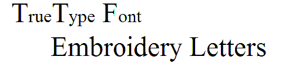

# Standard Fonts

The tables below display all embroidery fonts that are standard with EmbroideryStudio.

## Roman fonts

Roman character fonts include:

| [3D fonts](Roman_fonts)            | Created especially for use with foam – commonly used on caps as foam is not suitable for washing.                                                                                                                                                                                       |
| ---------------------------------- | --------------------------------------------------------------------------------------------------------------------------------------------------------------------------------------------------------------------------------------------------------------------------------------- |
| [Appliqué fonts](Roman_fonts)      | Created especially for appliqué, containing all the required outline, tack and cover stitches. Great for use on large scale and to reduce stitch count.                                                                                                                                 |
| [Bling fonts](Roman_fonts)         | Created especially for rhinestone and diamantes. They are vector format.                                                                                                                                                                                                                |
| [Block fonts](Roman_fonts)         | San-serif typeface style, very common with names and business logos. A great style for embroidery as it is clear and easy to read.                                                                                                                                                      |
| [Chenille fonts](Roman_fonts)      | Created especially for chenille embroidery but only suitable if your machine supports it. Commonly used for sport and street wear.                                                                                                                                                      |
| [Faux chenille fonts](Roman_fonts) | It is possible to modify Stipple Stemstitch Fill settings for a denser coverage. Combined with a thicker yarn such as Madeira’s Burmilana thread, it is possible to achieve a chenille effect. These dedicated fonts utilize this proven technique to create ‘faux chenille’ lettering. |
| [Fancy fonts](Roman_fonts)         | Anything that is not ‘blocky’ can be used in a decorative way, depending on the style of logo.                                                                                                                                                                                          |
| [Monogram fonts](Roman_fonts)      | Especially designed for monogramming purposes – commonly used for creating initials popular with gifts such as towels and linen.                                                                                                                                                        |
| [Outline fonts](Roman_fonts)       | Commonly used for sports wear, on back of jackets. Work best at larger scale.                                                                                                                                                                                                           |
| [Run stitch fonts](Roman_fonts)    | Commonly used for small lettering, anything under 5mm and where satin column are not suitable.                                                                                                                                                                                          |
| [Script fonts](Roman_fonts)        | Fluid strokes where characters connect, resembling a hand written style.                                                                                                                                                                                                                |
| [Serif fonts](Roman_fonts)         | Older style font which includes an embellishment at the ends of the stroke, popular with sportswear.                                                                                                                                                                                    |
| [Small fonts](Roman_fonts)         | Fonts which are 6mm and below, including satin stitch columns with push and pull adjustments.                                                                                                                                                                                           |
| [Special fonts](Roman_fonts)       | Graphical, multi-colors and fill effects are some of the things that are associated with special fonts. Commonly used for decorative purposes.                                                                                                                                          |
| [Two-color fonts](Roman_fonts)     | Each character contains two colors. Commonly used for sports wear, on back of jackets. Work best at larger scale.                                                                                                                                                                       |

## Non-Roman fonts

Non-Roman character fonts include:

- [Cyrillic fonts](Non-Roman_fonts)
- [Hebrew fonts](Non-Roman_fonts)
- [Japanese fonts](Non-Roman_fonts)

## Minimum & maximum sizes

For best results when stitching, do not exceed the recommended maximum or minimum sizes. Note, however, that recommended maximum and minimum heights refer to UPPER CASE letters. Most embroidery fonts are digitized from an original TrueType Font (TTF), some of which have lower-case letters – e.g. ‘a’ and ‘c’ – which are about 70% the height of a capital letter. As a result, these letters may be too small to embroider neatly. You may need to increase the size of the lower-case characters to suit the embroidery.

## Special characters

You can create special characters in each font by holding down the Alt key on your keyboard and typing 0 (zero), its code, using the numbers on the keypad. For example, to type ê with the code 234, type Alt+0234. The accented letter will appear when you release the Alt key. [See also Adding special characters.](../../Lettering/lettering_advanced/Adding_special_characters)

Note: Not all characters are available in all fonts.

## Join method

The lettering join method is preset to give the best results for each font. Options include:

| Join         |     | Purpose                                                                                                                |
| ------------ | --- | ---------------------------------------------------------------------------------------------------------------------- |
| Bottom join  | BJ  | Letters are joined along the baseline. Use it when stitching on towelling – joins are hidden in the pile.              |
| Closest join | CJ  | Letters are joined at the closest point. Use it to minimize trims.                                                     |
| As digitized | AD  | Letters are joined as they were digitized. Use it with fonts combining different fill stitch types or special effects. |
