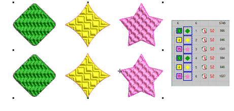
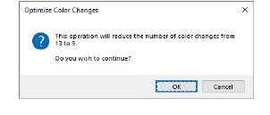
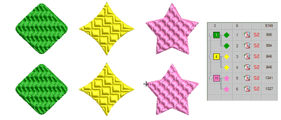

# Auto-sequence entire designs

The Optimize Color Changes feature improves the quality and efficiency of the stitchout by minimizing the number of color changes and trims. All existing overlaps are preserved by the operation. Grouped objects are not ungrouped but different colored objects are optimally sequenced regardless of grouping.

## To auto-sequence an entire design...

- Open or create a design and select objects to resequence.

- Select Arrange > Sequence > Optimize Color Changes or use the popup menu in the Color-Object List.

- Click OK to confirm. The system analyzes all selected objects and calculates optimal color changes and trims.

::: tip
The Undo command will reverse the effect of any sequencing changes.
:::

## Related topics...

- [Adjust entry/exit points](../../Quality/connectors/Adjust_entry_exit_points)
- [Minimizing connectors](../../Quality/connectors/Minimizing_connectors)
