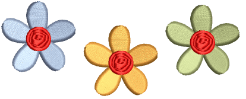

# Combining objects & designs

Objects can be combined to create composite designs. They can be inserted from disk, copied and pasted via the MS Windows® [clipboard](../../glossary/glossary#clipboard) for, or duplicated within the same design.

## Related topics...

- [Insert designs](Insert_designs)
- [Copy & paste objects](Copy_paste_objects)
- [Duplicate & clone objects](Duplicate_clone_objects)
- [Nest objects](Nest_objects)
