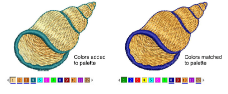
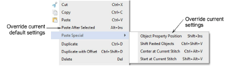

# Copy & paste objects

|      | Click Standard > Cut to remove selected objects to the clipboard. |
| ------------------------------ | ----------------------------------------------------------------- |
|    | Click Standard > Copy to copy selected objects to the clipboard.  |
|  | Click Standard > Paste to paste copied objects to a design.       |

You can copy objects to create multiple, identical objects, or to insert objects from other designs. Cut-and-paste action changes the [stitching sequence](../../glossary/glossary#stitching-sequence) in the design.

## To copy and paste objects...

- Select the object (or objects) and click Copy or press Ctrl+C. The selected object is copied to the [clipboard](../../glossary/glossary#clipboard).
- Optionally, change Insert Embroidery File options via the Options > General dialog. By default, when you insert a design, colors are added to the color palette.

- Optionally, change Paste options via the Options > Edit dialog.
- Optionally, travel to the position in the [stitching sequence](../../glossary/glossary#stitching-sequence) where you want to insert the object/s. Otherwise, it will be placed at the end of the stitching sequence.
- Click the Paste icon. The object is pasted according to current settings.
- Alternatively, use the Paste After Selected command to override current defaults and paste directly after the selected object in the stitching sequence.

- Alternatively, use the Paste Special flyout to override current paste position settings. Shortcut keys are available. Make sure there is only one copy of an object at any one position. If an object is pasted twice in the same position, it will be stitched twice.

## Related topics...

- [Paste & duplicate options](../../Setup/settings/Paste_duplicate_options)
- [Thread color handling for inserted files](../../Setup/settings/Thread_color_handling_for_inserted_files)
- [Sequencing embroidery objects](Sequencing_embroidery_objects)
- [Transforming Objects](../transform/Transforming_Objects)
