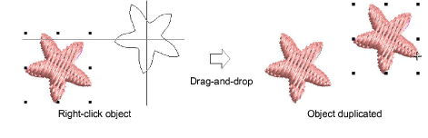
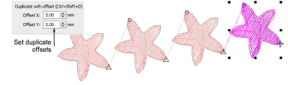

# Duplicate & clone objects

|  | Use Select > Select Object to select and clone objects. |
| -------------------------------------------- | ------------------------------------------------------- |

Objects can be duplicated rather than copied. When duplicated, the object is not copied to the [clipboard](../../glossary/glossary). This preserves the current contents of the clipboard. They can also be ‘cloned’.

## To duplicate or clone objects...

- Select an object or objects.
- Optionally, travel to the point in the [stitching sequence](../../glossary/glossary) where you want to place the duplicate. Otherwise, the duplicate object will be included at the end of the stitching sequence.
- It is handy to be able to ‘quick clone’ objects. Select the object and, holding down the right mouse button, drag to a new position. Hold down Ctrl to constrain movements horizontally or vertically.

- Optionally, select Edit > Duplicate or press Ctrl+D to keeping duplicating the last cloned object. This means you can step-repeat duplicate objects.
- Optionally, press Ctrl+Shift+D to duplicate with a preset offset. Adjust this setting via the Options > Edit dialog.

Tip: Clone objects to another window by the same method. To temporarily deactivate automatic scrolling, hold down the Shift key while dragging. Use the Window > New Tab Group commands to view multiple design tabs at the same time.

## Related topics...

- [Paste & duplicate options](../../Setup/settings/Paste_duplicate_options)
- [Travel through designs](../../Basics/view/Travel_through_designs)
- [Set up multiple views](../../Basics/view/Set_up_multiple_views)
