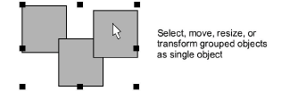
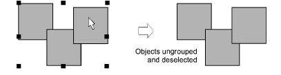
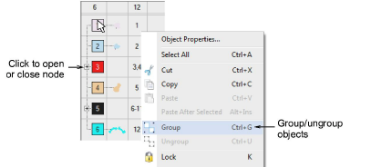

# Group & ungroup objects

|      | Use Arrange > Group to group selected objects.     |
| ---------------------------------- | -------------------------------------------------- |
|  | Use Arrange > Ungroup to ungroup selected objects. |

Group objects, or an entire design, to keep them together for moving, [scaling](../../glossary/glossary#scaling) and transforming actions. With grouped objects you can also apply global changes, saving time and ensuring consistency. When you have finished making changes to a group, you can ungroup and work with the component objects.

## To group or ungroup objects...

- Select objects and click the Group icon or press Ctrl+G.

Selected objects are combined. This group can be selected, moved, resized and transformed as a single object.

- To ungroup, select and click Ungroup or press Ctrl+U.

::: tip
The Color-Object List provides an easy way to select objects in designs and access their [properties](../../glossary/glossary#properties). Use it to group, lock, and hide objects.
:::

## Related topics...

- [Select objects with selection tools](../../Basics/basics/Select_objects_with_selection_tools)
- [Sequence with the Color-Object List](Sequence_with_the_Color-Object_List)
