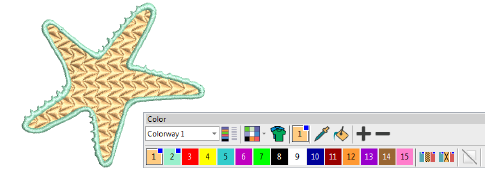
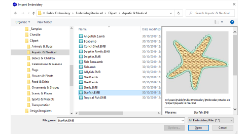
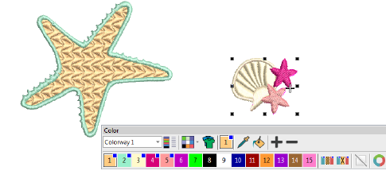
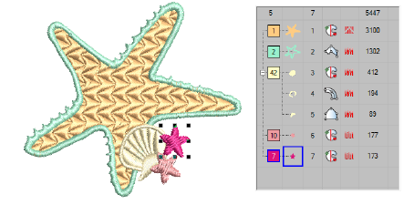

# Insert designs

|  | Click Standard > Import Embroidery to import embroidery design file into current design. |
| ---------------------------------------------------- | ---------------------------------------------------------------------------------------- |

EmbroideryStudio lets you insert one design into another. The two (or more) designs can then be saved as a combined design. When you insert a design into another, the two [color palettes](../../glossary/glossary) are combined. Colors with the same RGB values are automatically identified as having the same thread color. If you want to preserve them as separate colors, you need to change one or other before importing.

Tip: If you don’t know the origin of a design you are editing, you can insert it into a blank design file so that it acquires known fabric settings.

## To insert designs...

1Open the source design.

2Optionally, travel to the position in the [stitching sequence](../../glossary/glossary) where you want to insert the design. Otherwise, the inserted design will be placed at the end of the stitching sequence.

3Select Standard > Import Embroidery. File type defaults to the native ‘all-in-one’ EMB format but any supported embroidery file can be used.

4Select the design file to insert, and click Open. The design is inserted at the current needle position. By default, colors are added to the palette.

5Scale and position the inserted design as required. To ensure that all the objects in the inserted design stay together, group it first.

6Sequence colors for efficient stitchout.

Note: The Options > General tab provides another setting – ‘Match to palette’ – which matches inserted design colors to the current palette.

## Related topics...

- [Inserting designs with Embroidery Clipart](../../Management/manage_designs/Inserting_designs_with_Embroidery_Clipart)
- [Thread color handling for inserted files](../../Setup/settings/Thread_color_handling_for_inserted_files)
- [Sequencing embroidery objects](Sequencing_embroidery_objects)
- [Transforming Objects](../transform/Transforming_Objects)
