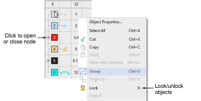

# Lock & unlock objects

|            | Use Arrange > Lock to lock selected objects.                       |
| -------------------------------------- | ------------------------------------------------------------------ |
|  | Use Arrange > Unlock All to unlock all locked objects in a design. |

Lock objects to prevent them from being moved or modified by accident. For example, locking [backdrop](../../glossary/glossary#backdrop) images holds them in place as you digitize, transform or reshape the embroidery objects near them.

## To lock or unlock objects...

- Select objects and click the Lock icon or press K.

[Selection handles](../../glossary/glossary) disappear, indicating that the object can no longer be selected or modified.

- To unlock objects, click the Unlock All icon or press Shift+K.

::: tip
The Color-Object List provides an easy way to select objects in designs and access their [properties](../../glossary/glossary#properties). Use it to group, lock, and hide objects.
:::

## Related topics...

- [Select objects with selection tools](../../Basics/basics/Select_objects_with_selection_tools)
- [Sequence with the Color-Object List](Sequence_with_the_Color-Object_List)
