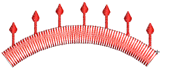
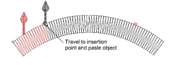

# Nest objects

EmbroideryStudio lets you ‘nest’ one object inside another at an exact point of the [stitching sequence](../../glossary/glossary). This feature is useful with motifs and other designs where long [connectors](../../glossary/glossary) may be generated. It also helps reduce overall numbers of objects, minimizing trims and tie-offs.

## To nest objects...

1. Travel through the object until the needle position marker is positioned where you want to insert the new object.

2. Either digitize the new object or copy and paste. The object is ‘nested’ inside the stitching sequence. All required functions are automatically added.

3. Use arrow keys to fine-tune placement of the new object.

## Related topics...

- [Paste & duplicate options](../../Setup/settings/Paste_duplicate_options)
