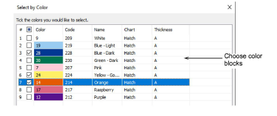
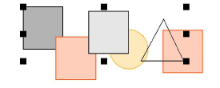

# Select objects by color

You can select [embroidery objects](../../glossary/glossary) of the same color with a single command.

## To select objects by color...

- Select Edit > Select by Color.

- Select color blocks from the list and click OK. All objects using the selected colors are selected in the design.

## Related topics...

- [View selected color blocks](../../Basics/view/View_selected_color_blocks)
- [Sequence with the Color-Object List](Sequence_with_the_Color-Object_List)
