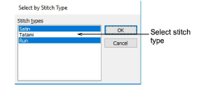
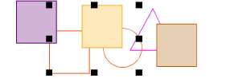

# Select objects by stitch type

You can select [embroidery objects](../../glossary/glossary) of the same stitch type with a single command.

## To select objects by stitch type...

1Select Edit > Select by Stitch Type. The Select by Stitch Type dialog opens.

2Select a stitch type from the list.

- To select a range of stitch types, hold down Shift as you click.
- To select multiple stitch types, hold down Ctrl as you click.

3Click OK. Objects using the selected stitch types are selected in the design.

## Related topics...

- [Select objects by color](Select_objects_by_color)
