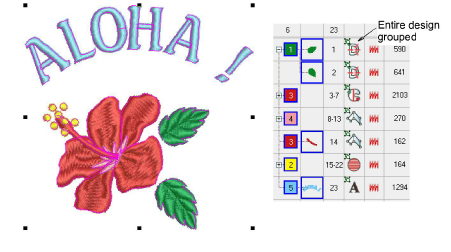

# Select objects within groups

|  | Use Select > Select Object to select individual objects as well as groups or ranges of objects. |
| ------------------------------------------------------ | ----------------------------------------------------------------------------------------------- |

EmbroideryStudio provides a method for selecting individual objects within object groupings. This is handy if you want to make changes ‘on-the-fly’ without first having to ungroup and then regroup objects.

## To select objects within groups...

- Click the Select Object icon or press 0.

- Use Alt+Click to select a single object within a group.
- Use Ctrl or Shift keys in combination with Alt to select multiple objects or a range of objects within a group.

- Use Alt+Drag to select by ‘selection marquee’.
- Use Alt+Polygon/Polyline to isolate objects as you select.
- Within the Color-Object List, use the same techniques to:
- Select a single object/color within a group (Alt+Click).
- Add/remove a single object/color within a group (Alt+Ctrl+Click).
- Select a range of objects/colors within a group (Alt+Shift+Click).

Note: Once an object (or more) is selected, all properties, stitching and otherwise, can be changed ‘inside’ the group without the need to ungroup/regroup.

## Related topics...

- [Select objects with selection tools](../../Basics/basics/Select_objects_with_selection_tools)
