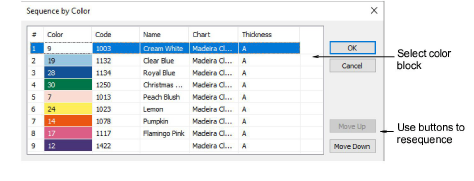

# Sequence by color

|  | Use Sequence > Sequence by Color to resequence all blocks of like color. |
| -------------------------------------------------- | ------------------------------------------------------------------------ |

The Sequence by Color feature lets you resequence all objects in a design by color. This technique resequences all color blocks of the same color.

## To sequence by color...

- Select the objects to resequence or press Ctrl+A to select the entire design.
- Click the Sequence by Color icon or select Arrange > Sequence > By Color. The Sequence by Color dialog opens listing colors in the selected objects.

- Select a color and click Move Up or Move Down to change its position in the sequence.

::: info Note
If you need to sequence separate color blocks, use the Color-Object List.
:::
