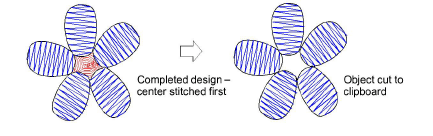
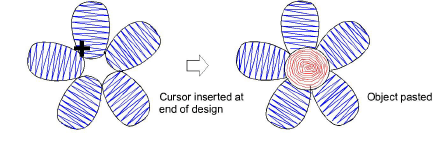
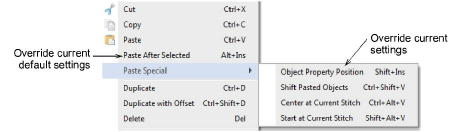

# Sequence by cut-and-paste

|      | Click Standard > Cut to cut a selected object or objects and place them on the clipboard. |
| ---------------------------------------- | ----------------------------------------------------------------------------------------- |
|  | Click Standard > Paste to paste copied objects in the design.                             |

You can resequence objects by cutting an object from the design and pasting it back at a different point in the sequence. This does not change its physical location.

## To sequence objects by cut-and-paste...

1Select the object (or objects) to resequence.

2Click the Cut icon. The selected object is removed to the [clipboard](../../glossary/glossary).

3Travel to the point in the [stitching sequence](../../glossary/glossary) where you want to paste the object. You can place it between other objects or ‘nest’ it within another object.

4Click the Paste icon. The object is pasted according to current settings.

- Alternatively, use the Paste After Selected command to override current defaults and paste directly after the selected object in the stitching sequence.

Note: Make sure there is only one copy of an object at any one position.

If an object is pasted twice in the same position, it will be stitched twice.

## Related topics...

- [Viewing stitching sequence](../../Basics/view/Viewing_stitching_sequence)
- [Nest objects](Nest_objects)
- [Paste & duplicate options](../../Setup/settings/Paste_duplicate_options)
