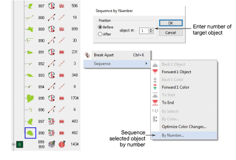

# Sequence by number

|  | Use Docker > Color-Object List to resequence objects. |
| ------------------------------------------------------------ | ----------------------------------------------------- |

You can resequence objects numerically in the Color-Object List. Use it to move an object to a position between consecutive members of a color block. This technique is used primarily with designs containing many objects where precise object sequencing is important.

## To sequence objects by number...

1Click the Color-Object List icon.

2Right-click an object in the list.

3Select Sequence > By Number from the popup menu. The Sequence by Number dialog opens.

4Enter the number of the object before which you want to position your selected object.

Note: If you prefer to position the selected object after a selected number – e.g. to make it the last object in the list – select After Position.

5Click OK. The selected object will be placed in the new position and all other objects resequenced accordingly.
