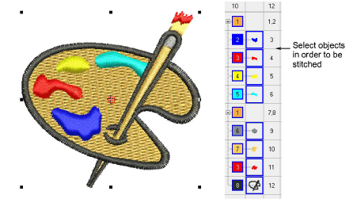
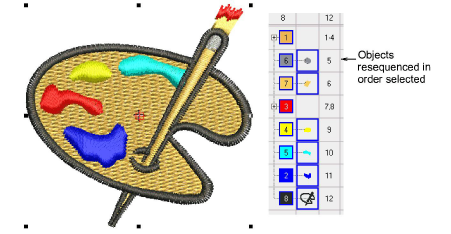

# Sequence by selection order

|  | Use Sequence > Sequence by Selects to resequence objects in the order selected. |
| ------------------------------------------------------ | ------------------------------------------------------------------------------- |

You can resequence objects by selecting them in the required stitching order.

## To sequence objects by selection order...

- Select the first object you want to resequence.

- Holding down Ctrl, select subsequent objects. Select each object in the order you want it to stitch out. Do this directly on-screen or via the Color-Object List.
- With objects still selected, select Arrange > Sequence > By Selects or click the Sequence by Selects icon. The objects are resequenced in the selection order.

::: tip
[Entry ](../../glossary/glossary)and [exit](../../glossary/glossary#exit) points should also be checked when you are resequencing objects in a design.
:::

## Related topics...

- [Adjust entry/exit points](../../Quality/connectors/Adjust_entry_exit_points)
- [Minimizing connectors](../../Quality/connectors/Minimizing_connectors)
