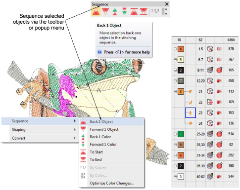

# Sequence selected objects

|      | Use Sequence > Back 1 Object to move a selection back one object in the stitching sequence.       |
| ---------------------------------------------- | ------------------------------------------------------------------------------------------------- |
|  | Use Sequence > Forward 1 Object to move a selection forward one object in the stitching sequence. |
|        | Use Sequence > Back 1 Color to move a selection back one color in the stitching sequence.         |
|  | Use Sequence > Forward 1 Color to move a selection forward one color in the stitching sequence.   |
|      | Use Sequence > Move to Start to move a selection to start of stitching sequence.                  |
|          | Use Sequence > Move to End to move a selection to end of stitching sequence.                      |

The Sequence toolbar provides a convenient means for sequencing selected objects. Use it in conjunction with the Color-Object List. Alternatively, use the popup menu Sequence option to resequence objects ‘on-the-fly’. The same options can be accessed from the Color-Object List popup menu.

Tip: [Entry ](../../glossary/glossary)and [exit](../../glossary/glossary) points should also be checked when you are resequencing objects in a design.

## Related topics...

- [Adjust entry/exit points](../../Quality/connectors/Adjust_entry_exit_points)
- [Minimizing connectors](../../Quality/connectors/Minimizing_connectors)
