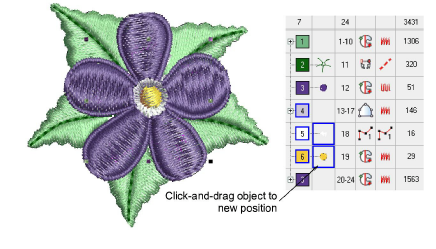
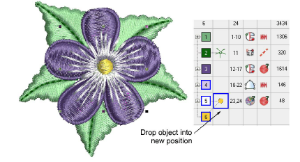

# Sequence with the Color-Object List

|  | Use Docker > Color-Object List to resequence objects. |
| -------------------------------------------------- | ----------------------------------------------------- |

The Color-Object List provides an easy way to select objects in designs and access their [properties](../../glossary/glossary).

## To sequence with the Color-Object List...

1Click the Color-Object List icon.

2Select the color block or object to resequence.

- To select a range of items, hold down Shift as you click.
- To select multiple items, hold down Ctrl as you click.

3Click-and-drag selected objects to reposition them.

Tip: You can also use the Color-Object List to group, lock, and hide objects.

## Related topics...

- [Grouping & locking objects](Grouping_locking_objects)
- [Copy & paste objects](Copy_paste_objects)
- [Adjust entry/exit points](../../Quality/connectors/Adjust_entry_exit_points)
- [Minimizing connectors](../../Quality/connectors/Minimizing_connectors)
