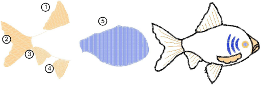

# Sequencing embroidery objects

The [embroidery objects](../../glossary/glossary#embroidery-objects) comprising a design form a ‘[stitching sequence](../../glossary/glossary#stitching-sequence)’. It is good practice to analyze and plan design shapes and stitching sequence in advance. Shapes need to be clearly defined to make them easy to embroider. The best shapes have relatively constant width, with smooth edges, no sharp turns and no small, protruding details. Details should always be stitched last.

If you are digitizing manually in Wilcom Workspace, objects are stitched in the order in which they were created. If you have converted a design directly from CorelDRAW Graphics to Wilcom Workspace, EmbroideryStudio uses automatic sequencing to determine the stitching sequence. You can always manually adjust the sequence to improve the stitchout – e.g. to minimize color changes.

::: tip
[Entry ](../../glossary/glossary)and [exit](../../glossary/glossary#exit) points should also be checked when resequencing objects in a design. [See also Adjust entry/exit points.](../../Quality/connectors/Adjust_entry_exit_points) [See also Minimizing connectors.](../../Quality/connectors/Minimizing_connectors)
:::

## Related topics...

- [Sequence by cut-and-paste](Sequence_by_cut-and-paste)
- [Sequence by color](Sequence_by_color)
- [Sequence by selection order](Sequence_by_selection_order)
- [Sequence selected objects](Sequence_selected_objects)
- [Sequence with the Color-Object List](Sequence_with_the_Color-Object_List)
- [Sequence by number](Sequence_by_number)
