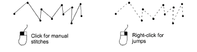

# Digitizing manual stitches

|              | Use Traditional Digitizing > Manual to digitize individual ‘manual’ stitches.    |
| -------------------------------------------- | -------------------------------------------------------------------------------- |
|  | Use Traditional Digitizing > Triple Manual to digitize triple ‘manual’ stitches. |

Occasionally you may need to digitize individual stitches. Use these sparingly, for example, to add a few details to a finished design. Digitize individual stitches with the Manual method. You can enter single manual stitches, or enter three stitch layers at a time with the Triple Manual tool. Manual stitches digitized together form a single embroidery object. The only properties of [manual objects](../../glossary/glossary) are general and [connector](../../glossary/glossary) properties. They are not well suited to [scaling](../../glossary/glossary) and transforming actions. Use them sparingly, for example to add a few stitches to a finished design.

Caution: Manual stitches are not well suited to [scaling](../../glossary/glossary) and transforming actions as the stitches have no associated [properties](../../glossary/glossary). Use them sparingly.

## To digitize individual stitches...

1. Click the Manual or Triple Manual icon.

2. Click to mark the start of the stitch and again to mark its end.

The end-point becomes the beginning of the next stitch.

3. Continue marking stitch points until the manual stitch object is complete.

Tip: Stitches that are too long will automatically become jump stitches, but you can also create jumps manually by right-clicking as you digitize.

Tip: You can also use manual stitching together with machine functions to create boring holes. If your embroidery machine is equipped with a boring knife or needle, you can use the Borers tool to turn needle penetrations into boring holes, regardless of selected stitch type. Holes are cut in the fabric, producing an effect similar to lace.

## Related topics...

- [Use jumps as connectors](../../Quality/connectors/Use_jumps_as_connectors)
- [Boring](../../Applied/mixed/Boring)
