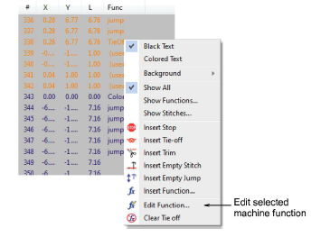
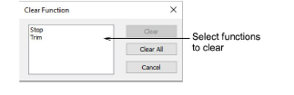
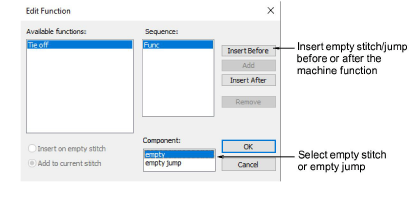

# Edit machine functions manually

|  | Use Docker > Stitch List to toggle Stitch List display on/off. Use it to edit machine function encoding and to clear machine functions. |
| -------------------------------------------------- | --------------------------------------------------------------------------------------------------------------------------------------- |
|      | Click Function > Clear Function to remove machine functions at current stitch cursor position.                                          |
|        | Click Function > Edit Function to edit machine function at current stitch cursor position.                                              |

You can edit the encoding of machine functions by changing the number or sequence of [empty stitches](../../glossary/glossary) or [empty jumps](../../glossary/glossary) that appear around them. Some machines require a specific number of empty stitches or empty jumps in combination with a function in order to interpret it correctly. You may need to edit functions if they were inserted incorrectly or the machine format has changed.

::: info Note
Both automatic and manually-inserted functions can be removed. Functions added by EmbroideryStudio are automatically updated if an object is modified or the [machine format](../../glossary/glossary#machine-format) changes. Manually inserted machine functions are not automatically removed or updated. You generally only need to edit manually inserted machine functions. If a function is no longer required, it must be manually cleared from the design.
:::

## To edit machine functions manually...

- Open the Stitch List and locate the position in the stitching sequence where you want to insert the machine function. Alternatively, use the travel functions to locate the insertion point. The function name appears in the Prompt Bar.

- To remove the function altogether, select Clear &lt;function&gt; from the popup menu.
- If a stitch includes more than one machine function – e.g. Trim and Tie-off – the Clear &lt;function&gt; command will invoke the Clear Function dialog. Use this to selectively clear functions as desired.

- Right-click the function and select Edit Function from the popup menu. Alternatively, click the Edit Function icon or select Function > Edit Function. The Sequence panel shows the current format of the selected function.

- To insert additional empty stitches or empty jumps, select one or other in the Component field.
- Use the buttons to insert additional components before or after the selected function. Click Insert Before if you need the empty stitch/jump to precede the selected function.
- To insert multiple empty stitches or jumps, click Add.
- To delete an empty stitch or empty jump from the sequence, select and click Remove.

## Related topics...

- [Travel through designs](../../Basics/view/Travel_through_designs)
