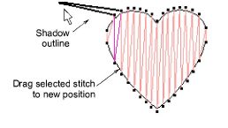
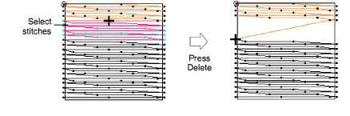
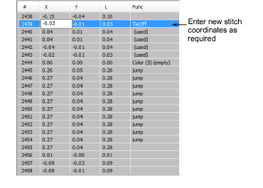

# Edit stitches

|  | Use Stitch > Stitch Edit to select individual stitches for moving.                                                |
| -------------------------------------------------- | ----------------------------------------------------------------------------------------------------------------- |
|  | Use Docker > Stitch List to toggle Stitch List display on/off. Use it to edit coordinates of individual stitches. |

You can move or delete individual or groups of selected stitches.

## To edit stitches...

- Click the Stitch Edit icon and zoom into the area you want to edit.
- Select stitches and drag them to a new position.

- Select a stitch or stitches and press Delete.

- Open the Stitch List and double-click the stitch coordinate you want to edit.

- Enter new coordinates in the X and Y fields and press Enter. The new coordinates will change the location of the stitch end point.

::: warning Caution
If an object’s stitches are regenerated for any reason, all stitch editing functions are lost. Where possible, reshape the object rather than move individual stitches.
:::

## Related topics...

- [Reshaping Objects](../reshape/Reshaping_Objects)
- [Select stitches with the Stitch List](Select_stitches_with_the_Stitch_List)
