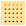
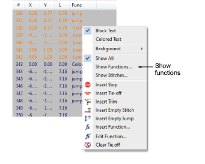
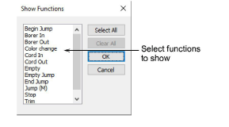
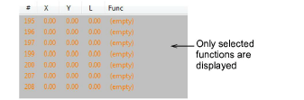

# Filter stitches by function

|  | Use Docker > Stitch List to toggle Stitch List display on/off. Use it to display stitches associated with specific functions. |
| -------------------------------------------------- | ----------------------------------------------------------------------------------------------------------------------------- |

You can apply a filter to the Stitch List so that only stitches associated with specific functions appear in the list.

## To filter stitches by function...

1. Open the Stitch List.

2. Right-click a stitch and select Show Functions from the popup menu.

3. Select the functions you want to show.

::: tip
To select multiple functions, use Ctrl or Shift keys as you click. Click Select All to show all function types.
:::

4. Click OK. Selected functions are displayed in the list.

::: tip
To display the text in the associated stitch color, select Colored Text from the popup menu.
:::

5. To show all stitches again, right-click in the Stitch List and select Show All from the popup menu.

## Related topics...

- [Select stitches with the Stitch List](Select_stitches_with_the_Stitch_List)
