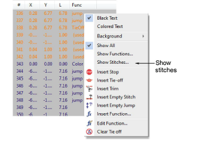
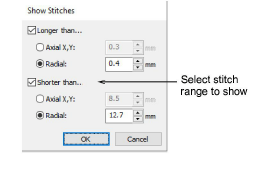
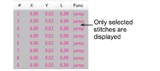

# Filter stitches by stitch length

|  | Use Docker > Stitch List to toggle Stitch List display on/off. Use it to display only stitches of a certain length. |
| -------------------------------------------------- | ------------------------------------------------------------------------------------------------------------------- |

You can apply a filter to the Stitch List so that only stitches of a certain length appear in the list. The main use of this feature is to find stitches which cause production problems, such as short stitches (e.g. < 1.0 mm).

## To filter stitches by stitch length...

1Open the Stitch List.

2Right-click a stitch and select Show Stitches from the popup menu. The Show Stitches dialog opens.

3Select the range of stitch lengths you want to show:

| Option    | Function                                                    |
| --------- | ----------------------------------------------------------- |
| Radial    | Corresponds to the actual stitch length.                    |
| Axial X,Y | Corresponds to the horizontal and vertical frame movements. |

4Click OK. Only the selected stitches are displayed in the list.

Tip: To display the text in the associated stitch color, select Colored Text from the popup menu.

5To show all stitches again, right-click in the Stitch List and select Show All from the popup menu.

## Related topics...

- [Select stitches with the Stitch List](Select_stitches_with_the_Stitch_List)
- [Eliminating small stitches](../../Quality/quality/Eliminating_small_stitches)
- [Preserve long stitches](../../Quality/quality/Preserve_long_stitches)
