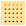
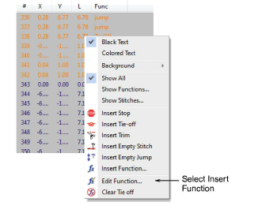
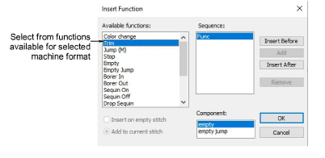
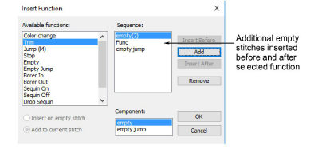
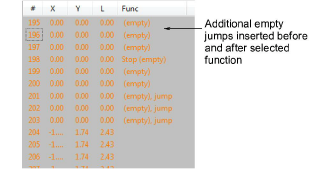

# Insert machine functions manually

|  | Use Docker > Stitch List to toggle Stitch List display on/off. Use it to insert machine functions directly into the stitching sequence. |
| -------------------------------------------------- | --------------------------------------------------------------------------------------------------------------------------------------- |
|    | Click Function > Insert Function to insert machine function at current stitch cursor position.                                          |

You can insert machine functions manually by means of the Insert Function dialog. Depending on your machine’s requirements, you will either add the function to the current stitch, or insert it on an [empty stitch](../../glossary/glossary#empty-stitch) or [empty jump](../../glossary/glossary#empty-jump). For some machines you will also need to add empty stitches or empty jumps on either side of some functions. See your machine manual for details.

::: warning Caution
When you insert machine functions manually, you must maintain them manually. For this reason, only insert manual functions if they cannot be added automatically.
:::

## To insert machine functions manually...

- Open the Stitch List and locate the position in the stitching sequence where you want to insert the machine function. Alternatively, use the travel functions to locate the insertion point. The function name appears in the Prompt Bar.

- Right-click the stitch and select Insert Function from the popup menu.

Alternatively, click the Insert Function icon or select Function > Insert Function.

- From the Available Functions list, select the function you want to insert. Available functions and their options depend on the current [machine format](../../glossary/glossary#machine-format).

::: tip
It is faster to digitize individual jumps – Jump(M) – by right-clicking with the Manual input method selected. If you want the whole object to consist of jumps, deselect the Penetrations icon.
:::

- If available, choose an insertion method. With some functions you can choose whether to insert on the current stitch or on an [empty stitch](../../glossary/glossary#empty-stitch).
- To insert additional empty stitches or empty jumps, select one or other in the Component field.

Depending on your machine, you may need to insert additional empty stitches or [empty jumps](../../glossary/glossary) before or after the selected function. For example, before a particular Stop function, you may need to insert a number of empty jumps. See your machine manual for details.

- Use the buttons to insert additional components before or after the selected function.

Click Insert Before if you need the empty stitch/jump to precede the selected function.

- To insert multiple empty stitches or jumps, click Add. The selected function, together with any additional empty stitches or jumps, appears in the Sequence panel.

- Click OK to insert. The selected function, together with any additional empty stitches or jumps, is added at the current needle position. The name of the inserted function appears in the Prompt Bar.

## Related topics...

- [Create designs from templates](../../Basics/basics/Create_designs_from_templates)
- [Travel through designs](../../Basics/view/Travel_through_designs)
- [Select stitches with the Stitch List](Select_stitches_with_the_Stitch_List)
- [Add jumps with penetrations off](../../Quality/connectors/Add_jumps_with_penetrations_off)
