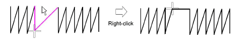

# Insert stitches

|  | Use Stitch > Stitch Edit to insert stitches in an object. |
| -------------------------------------------------- | --------------------------------------------------------- |

You can insert stitches in an object to fill gaps. Inserted stitches are considered part of the object. They will, however, be lost if the object’s stitches are regenerated. Where possible, edit [object properties](../../glossary/glossary) rather than individual stitches. For example, to increase stitch density, reduce spacing rather than insert stitches.

## To insert stitches...

1Click the Stitch Edit icon and zoom into the area you want to edit.

2Select a needlepoint.

3Move the mouse pointer where you want to insert the new stitch, and right-click.

Note: Inserting stitches is different from creating stitches using the Manual input method. With this tool you create a separate object, with its own properties and [connectors](../../glossary/glossary).

## Related topics...

- [Digitizing manual stitches](Digitizing_manual_stitches)
