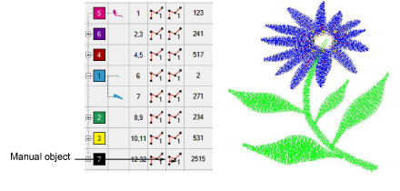
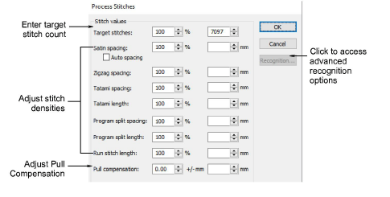
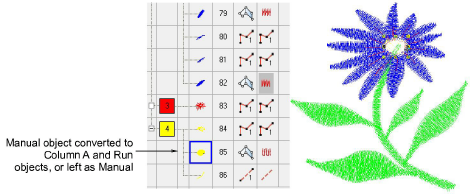

# Process manual stitches

|  | Use Stitch > Process Stitches to adjust stitch density of and/or scale whole or selected parts. |
| -------------------------------------------------- | ----------------------------------------------------------------------------------------------- |

You can process manual stitches to recognize outlines or adjust size and stitch density. You can also use the Process Stitches feature to change stitch count and density for the whole design, or for objects of a particular stitch type only.

Tip: You can also split larger [manual objects](../../glossary/glossary) into smaller objects, and process them individually.

## To process manual stitches...

1Open a machine file without object/outline recognition.

2Edit parts of the design as required.

3Select the part of the design you want to process. You can select the whole design or individual manual objects.

4Select Stitch > Process Stitches. The Process Stitches dialog opens.

5In the Stitch Values panel, enter the number of Target Stitches as either a percentage or absolute value (in millimeters).

6Adjust the density for each stitch type as required. You can change the density for selected objects and/or for specific stitch types only.

7Click Recognition to set advanced recognition options as required.

8Click OK. Selected objects are processed and converted to [Column A](../../glossary/glossary) or Run objects with fill or outline stitch [properties](../../glossary/glossary) as well as general and connector properties. If an object is not recognized, it remains a [manual object](../../glossary/glossary) with general and connector properties only. In this case, the target stitch count may not be reached.

Note: Process Stitches adds the missing information to the file, but does not change the stitches.

## Related topics...

- [Adjusting stitch densities](../../Quality/quality/Adjusting_stitch_densities)
- [Splitting objects](../reshape/Splitting_objects)
- [Advanced recognition settings](../../Production/convert/Advanced_recognition_settings)
