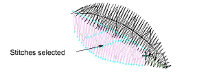
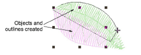

# Recognize object outlines

|  | Use Stitch > Stitch Edit together with Recognize Objects/Outlines to turn selected stitches into an embroidery object. |
| -------------------------------------------------- | ---------------------------------------------------------------------------------------------------------------------- |

New or revised object outlines can be [recognized ](../../glossary/glossary)after stitch edits have been made. This is useful with machine files which have been opened without Object/Outline recognition. You may do this to preserve the original stitching in most of the design, while modifying a single section of it. You may also want to turn edited stitches into an embroidery object in order to preserve the edits.

## To recognize object outlines...

1. Click the Stitch Edit icon and select the individual stitches you want to process.

2. Select Stitch > Recognize Objects/Outlines. The selected stitches are converted to objects.

## Related topics...

- [Opening machine files](../../Production/convert/Opening_machine_files)
- [Selecting & editing stitches](Selecting_editing_stitches)
